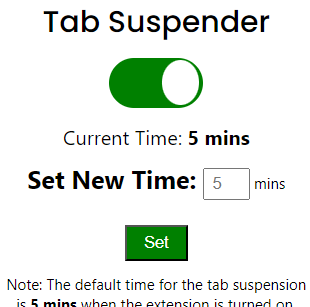

# tab_session_suspender

<h1 align="center" style="border-bottom: none">
    <b>
        <a href="https://www.google.com">Tab Session Suspender Extension</a> 
    </b>
    Suspends browswer tabs which have been inactive for a long time. The cherry on the top being, the inactivity time can be user's choice.  
</h1>

<!-- # [`Website link`](http://www.google.com) [`Demo video link `](http://www.google.com) [`Other links `](http://www.google.com) -->

Thus, the goal of this project is to improve the performance of the browser. The extensions when turned on checks the tabs which have been inactive for some time (as per the user's preferences) and just suspends the tab, therefore making the tab inactive.

## Team Details

<!-- `Team number` : VH000 -->

| Name             | Email                  |
| ---------------- | ---------------------- |
| Harsha Vasireddy | cs20b1033@iiitdm.ac.in |
| M Praveen        | cs20b1023@iiitdm.ac.in |

    
    
    
    

## Problem statement

The idea of the project lies on the fact that browser tabs use the memory and most times when there exists lot of tabs, few of them not used for some time still consume memory therefore slowly the browser's experience/performance. Thus the project tries to improve the performance of the browser. The extensions when turned on checks the tabs which have been inactive for some time (as per the user's preferences) and just suspends the tab, therefore making the tab inactive.

## About the project

In the project, the last active time of the tabs is stored in an object. We have a inactivity threshold time set at 5 mins. We have functions to check the last active time of each tab based on their ids, check whether a tab is playing audio or video (considered as active tab) and then a main function "checkTabInavtivity" to suspend the inactive tabs. We consider the event Listeners employed like the UI button to ON/OFF, "Set" button, page loads, etc. for the extension. The extension also utilizes the chrome storage to store the tab suspension state.

## Technical implementaion

- The first part starts with creating the manifest file which forms the base for every extension.
- Then, the UI of the extension is developed using HTML, CSS. The UI includes the options of ON/OFF button, set new time.
- The functionality of the extension lies on the main function `checkTabInavtivity` function which retrieves the entire info of the tab right from it's id, last active time.
- The above function is aided with other functions like `isTabPlayingAudioOrVideo`, `updateTabActivity`, `suspendTab` which are responsible for the tabs data.
- In the UI, we have the option for ON/OFF button, which when toggled triggers the `toggleTabSuspension` function which sets the interval time.
- when the user sets the new time, the new time is stored in the chrome storage till the browser is active. Once, the browser is closed, it is also lost.
- The updates from the UI are handled by the query selector.

## Techstacks used

`HTML` , `CSS` , `Javascript`

## How to run locally

- step 1 : clone the repo

- step 2 : Go to `brave://extensions/` or `chrome://extensions/`

- step 3 : Enable the Developer Mode option.

- step 4 : Once the Developer mode is enabled, choose the option of `Load Unpacked`.

- step 5 : Choose/Open the entire extension folder from your local directory to add the extension to your extensions list.

- step 6 : Pin the extension and enjoy it's features.

# What's next ?

The first thing would be adding to the chrome extension list. Following the major goal would be optimize the process, make it more efficient.

## Declaration

We confirm that the project showcased here was either developed entirely during the hackathon or underwent significant updates within the hackathon timeframe. We understand that if any plagiarism from online sources is detected, our project will be disqualified, and our participation in the hackathon will be revoked.
